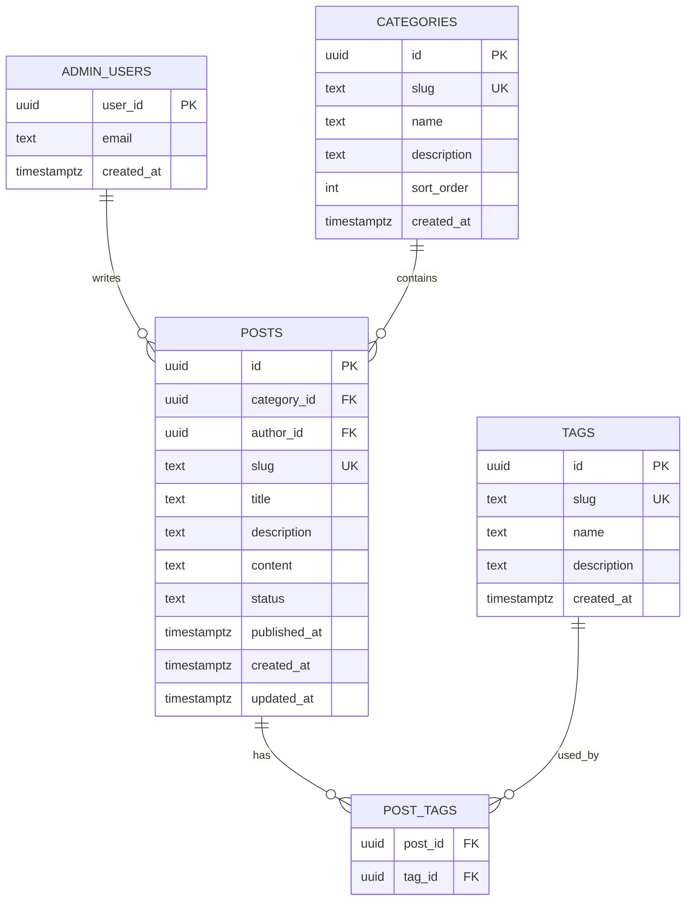

# Supabase ERD 설계

목적: 2차 MVP에서 관리자만 블로그 글을 추가/수정할 수 있도록 Supabase 기반 DB 구조와 RLS 기준을 정한다.

관련 문서:

- 개발 순서: [기술블로그 프로젝트 개발 로드맵](./01-blog-project-roadmap.md)
- 공부 순서: [학습 로드맵](./02-study-blogging-roadmap.md)

---

## 1. 도입 시점

Supabase는 2차 MVP에서 도입한다. 1차 MVP에서는 샘플 데이터 또는 파일 기반으로 시작하고, 2차 MVP에서 관리자 글 관리 기능으로 확장한다.

1. Home/Resume/Blog 기반 1차 MVP 완성
2. Vercel 1차 배포 완료
3. 관리자만 글을 추가/수정할 수 있는 기능이 필요한 시점

도입 목적:

- 관리자 화면에서 글 추가/수정
- draft/published 상태 관리
- 태그/카테고리 관리
- published 글만 공개 조회

지금 하지 않을 것:

- 댓글
- 좋아요
- 조회수
- 학습 로그
- GitHub API snapshot
- 복잡한 권한 시스템

---

## 2. 1차 구현 범위

테이블:

- `admin_users`
- `categories`
- `posts`
- `tags`
- `post_tags`

기능:

- Admin 로그인
- 글 작성/수정
- draft/published 상태 변경
- 태그/카테고리 관리
- 공개 페이지에서 published 글만 조회

---

## 3. ERD

관계:

- admin user는 여러 post를 작성할 수 있다.
- category 하나는 여러 post를 가진다.
- post 하나는 여러 tag를 가질 수 있다.
- tag 하나는 여러 post에 붙을 수 있다.
- post와 tag는 N:M 관계라서 `post_tags`가 필요하다.

---

## 4. 테이블 설계

### `admin_users`

| 컬럼 | 타입 | 설명 |
|---|---|---|
| `user_id` | `uuid` | Supabase Auth user id |
| `email` | `text` | 관리자 이메일 |
| `created_at` | `timestamptz` | 생성일 |

### `categories`

| 컬럼 | 타입 | 설명 |
|---|---|---|
| `id` | `uuid` | PK |
| `slug` | `text` | URL용 고유 값 |
| `name` | `text` | 화면 표시 이름 |
| `description` | `text` | 설명 |
| `sort_order` | `int` | 정렬 |
| `created_at` | `timestamptz` | 생성일 |

초기 예시:

- `javascript`
- `typescript`
- `react`
- `nextjs`
- `browser`
- `performance`
- `project-log`
- `ai`

### `posts`

| 컬럼 | 타입 | 설명 |
|---|---|---|
| `id` | `uuid` | PK |
| `category_id` | `uuid` | `categories.id` |
| `author_id` | `uuid` | `admin_users.user_id` |
| `slug` | `text` | URL용 고유 값 |
| `title` | `text` | 제목 |
| `description` | `text` | 요약 |
| `content` | `text` | Markdown/MDX 본문 |
| `status` | `text` | `draft`, `published`, `archived` |
| `published_at` | `timestamptz` | 발행일 |
| `created_at` | `timestamptz` | 생성일 |
| `updated_at` | `timestamptz` | 수정일 |

필수 제약:

- [ ] `slug` unique
- [ ] `status`는 `draft`, `published`, `archived`만 허용
- [ ] 공개 query는 항상 `status = 'published'`

### `tags`

| 컬럼 | 타입 | 설명 |
|---|---|---|
| `id` | `uuid` | PK |
| `slug` | `text` | URL용 고유 값 |
| `name` | `text` | 화면 표시 이름 |
| `description` | `text` | 설명 |
| `created_at` | `timestamptz` | 생성일 |

### `post_tags`

| 컬럼 | 타입 | 설명 |
|---|---|---|
| `post_id` | `uuid` | `posts.id` |
| `tag_id` | `uuid` | `tags.id` |

필수 제약:

- [ ] `post_id`, `tag_id` 복합 primary key
- [ ] post 삭제 시 연결 row 삭제
- [ ] tag 삭제 시 연결 row 삭제

---

## 5. RLS 기준

### 공개 조회

- [ ] `categories`: 누구나 조회 가능
- [ ] `tags`: 누구나 조회 가능
- [ ] `posts`: `status = 'published'`인 글만 조회 가능
- [ ] `post_tags`: published post에 연결된 row만 조회 가능

### Admin 권한

- [ ] Admin 여부는 `admin_users.user_id = auth.uid()`로 판단한다.
- [ ] 글 생성/수정/삭제는 admin만 가능하다.
- [ ] 카테고리/태그 생성/수정/삭제는 admin만 가능하다.

### 보안 주의

- [ ] service role key는 client에 절대 넣지 않는다.
- [ ] 공개 페이지에서는 draft 글이 보이면 안 된다.
- [ ] RLS 없이 client에서만 필터링하지 않는다.
- [ ] Admin API는 서버에서 권한을 한 번 더 확인한다.

---

## 6. 구현 순서

1. Supabase 프로젝트 생성
2. Auth 활성화
3. `admin_users` 생성
4. `categories`, `posts`, `tags`, `post_tags` migration 작성
5. RLS enable
6. public read policy 작성
7. admin write policy 작성
8. seed data 작성
9. Supabase client/server client 분리
10. 공개 글 목록 query
11. 공개 글 상세 query
12. Admin 글 작성/수정
13. draft 글이 공개 페이지에 보이지 않는지 확인
14. service role key client 노출 여부 확인

완료 기준:

- [ ] Admin에서 글을 작성/수정할 수 있다.
- [ ] published 글만 공개 조회된다.
- [ ] draft 글은 공개 페이지에 보이지 않는다.
- [ ] service role key가 client에 노출되지 않는다.
