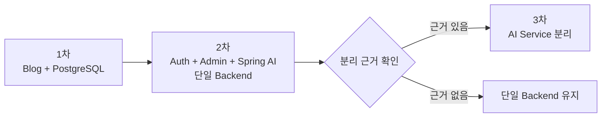

# 단계별 아키텍처

이 디렉터리는 기술 블로그를 한 번에 분리하지 않고 동작하는 기능을 단계적으로 확장하기 위한 아키텍처 기준입니다.

| 단계                            | 목표                                               | Backend 구성                          | Database                                     |
| ------------------------------- | -------------------------------------------------- | ------------------------------------- | -------------------------------------------- |
| [1차](phase-1-blog.md)          | 공개 Blog를 PostgreSQL 기반으로 전환하고 운영 연결 | 단일 Spring Boot의 Category·Post      | `categories`, `posts`                        |
| [2차](phase-2-auth-admin-ai.md) | 회원가입·이메일 인증·로그인·관리자·Spring AI 검증  | 단일 Spring Boot의 Blog·Auth·Admin·AI | Blog + User·Email Verification·Refresh Token |
| [3차](phase-3-ai-service.md)    | 운영이 확인된 AI 기능만 별도 서비스로 분리         | `backend` + `ai-service`              | Blog Backend만 PostgreSQL 소유               |

## 적용 원칙

- 각 아키텍처 단계 안에서도 `개인 수동 실습 → 반복 가능한 로컬 설정 → 팀 재현 → 운영 배포` 순서를 유지합니다.
- Docker는 PostgreSQL CLI 실행으로 기본 개념을 확인한 뒤 Compose와 Spring Dockerfile로 확장합니다.
- 1차가 실제 API·화면·배포에서 완료된 뒤 2차를 시작합니다.
- 2차에서는 Spring AI를 별도 서비스로 시작하지 않고 기존 Spring Boot 안에 먼저 구현합니다.
- 3차 분리는 호출량, 장애 격리, 독립 배포 또는 자원 사용 근거를 확인한 뒤 진행합니다.
- 각 단계의 목표 디렉터리는 미래 구조이며 실제 코드가 생기기 전에는 완료로 표시하지 않습니다.
- 공통 데이터 계약은 [API 명세](../api-spec.md), 에러 code는 [공통 에러 코드 계약](../error-codes.md), 오류 경계는 [Frontend·Backend 오류 처리 설계](../error-handling.md), 테이블 상세는 [데이터베이스 설계](../database-design.md)를 따릅니다. 로컬 구축과 실행은 [단계별 세팅 안내](../setup/README.md), 구현 판단과 검증 누락 확인은 [개발 체크포인트](../development-roadmap.md)를 참고합니다.

## 단계 전환

