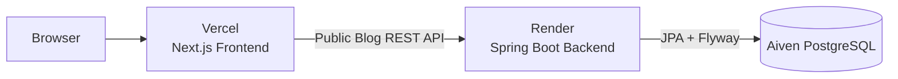
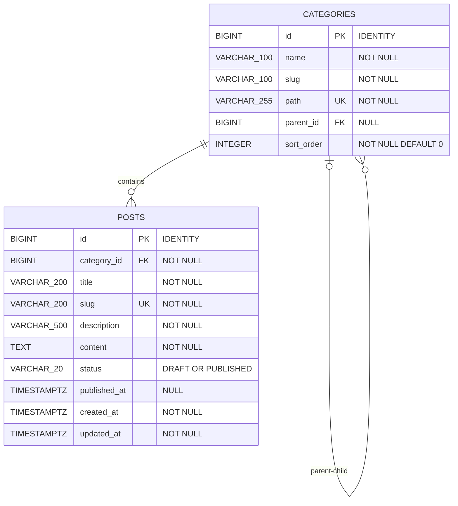

# 1차 아키텍처: 공개 Blog 전환

## 목표

기존 Next.js 화면과 URL을 유지하면서 Markdown mock 조회를 Spring Boot·PostgreSQL 공개 Blog API로 교체하고 Vercel·Render·Aiven 운영 흐름을 검증합니다.

## 포함 범위

- Category·Post PostgreSQL schema와 Flyway V1·V2
- `GET /api/categories`, `GET /api/posts`, `GET /api/posts/{slug}`
- JPA Repository·Service·Controller와 통합 테스트
- Docker CLI 학습, Docker Compose 로컬 재현, Render Backend와 Aiven PostgreSQL 배포
- 기존 Next.js Blog 목록·상세·카테고리 연결

로그인, 관리자 작성, Spring Security, Spring AI와 서비스 분리는 포함하지 않습니다.

## 시스템 구조



## 목표 프로젝트 디렉터리

```text
tech_blog/
├─ .env.example                           # PostgreSQL Compose 변수 예시
├─ compose.yaml                           # 현재 PostgreSQL, 5단계 Backend 추가 목표
├─ frontend/
│  ├─ .env.example                        # Next.js 변수 예시
│  ├─ src/app/blog/                       # 기존 목록·상세·카테고리 화면
│  ├─ src/services/blog.ts                # Spring API 호출 경계
│  ├─ src/types/blog.ts                   # 기존 응답 타입
│  └─ content/blog/                       # V2 이전 전까지 원본 유지
├─ backend/
│  ├─ .env.example                        # Spring datasource 변수 예시
│  ├─ build.gradle
│  ├─ gradlew
│  ├─ Dockerfile
│  └─ src/
│     ├─ main/java/com/pigpgw/techblog/
│     │  ├─ TechBlogApplication.java
│     │  ├─ category/
│     │  │  ├─ controller/
│     │  │  ├─ service/
│     │  │  ├─ repository/
│     │  │  ├─ domain/
│     │  │  └─ dto/
│     │  ├─ post/                         # controller·service·repository·domain·dto
│     │  └─ common/
│     │     ├─ config/
│     │     └─ exception/
│     ├─ main/resources/
│     │  ├─ application.properties
│     │  └─ db/migration/
│     │     ├─ V1__create_blog_schema.sql
│     │     └─ V2__seed_initial_post.sql
│     └─ test/java/com/pigpgw/techblog/
└─ docs/
```

## 1차 ERD



## Migration

| 버전 | 역할                                                           |
| ---- | -------------------------------------------------------------- |
| V1   | `categories`, `posts`, 제약조건과 FK index 생성                |
| V2   | 보호된 `미분류`와 기존 공개 Markdown Category·Post 데이터 추가 |

V2는 데이터만 추가하므로 1차 ERD의 구조는 바뀌지 않습니다. `미분류`는 slug·path `uncategorized`를 사용하는 최상위 Category이며 관리자 단계에서 변경·삭제를 제한합니다.

## 로컬 초기화 경계

실제 명령과 확인 방법은 [로컬 Database 세팅](../setup/database.md), [Backend–Database 연결](../setup/backend-database.md), [Flyway migration](../setup/flyway.md)을 따릅니다.

- 먼저 PostgreSQL 공식 image를 `docker run`으로 직접 실행해 container·port·환경변수·volume의 역할을 확인합니다.
- 확인한 Docker CLI option을 PostgreSQL Compose 설정으로 옮겨 개인 환경에서 반복 실행합니다.
- PostgreSQL Compose는 `POSTGRES_USER`, `POSTGRES_DB`와 `DB_PASSWORD`로 빈 Named Volume의 Role·Database만 생성합니다.
- Spring은 로컬에서 먼저 직접 실행하고 Blog API 검증 후 Compose에 추가합니다.
- Category·Post Schema와 초기 데이터는 Docker init SQL에 중복하지 않고 Flyway V1·V2로만 관리합니다.
- Homebrew PostgreSQL 수동 설정은 Docker를 사용할 수 없을 때의 대체 경로입니다.
- 전체 개인 개발 흐름이 확인된 뒤 새 clone·빈 volume 온보딩과 CI로 팀 재현성을 검증합니다.

## API

- `GET /api/categories`
- `GET /api/posts`
- `GET /api/posts/{slug}`

Entity는 반환하지 않고 `CategoryResponse`, `PostSummaryResponse`, `PostDetailResponse`로 변환합니다.

## 완료 기준

- 빈 PostgreSQL에 V1·V2가 순서대로 적용됩니다.
- Repository·API 통합 테스트가 Testcontainers PostgreSQL에서 성공합니다.
- Render URL에서 Category·Post 목록·상세와 Actuator health가 정상입니다.
- Vercel의 기존 `/blog`, `/blog/[slug]`, 카테고리 URL과 검색이 유지됩니다.
- 실제 운영 연결이 확인되기 전에는 2차 인증 기능을 추가하지 않습니다.
