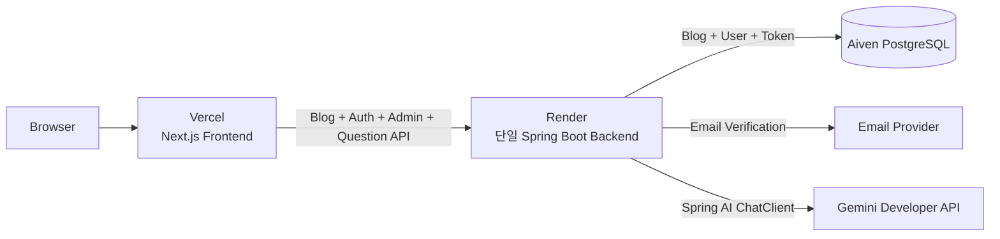
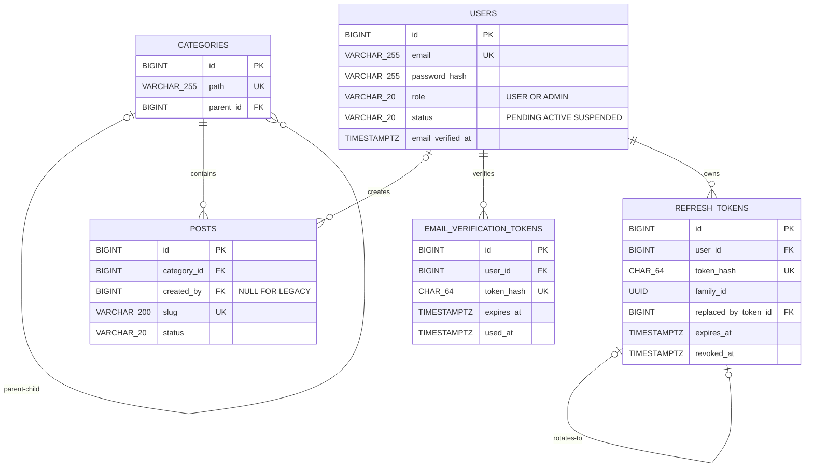

# 2차 아키텍처: Auth·관리자·Spring AI 단일 Backend

## 목표

1차에서 운영 검증된 Spring Boot Backend에 일반 사용자 회원가입·로그인, 관리자 전용 Markdown 게시글 관리와 Spring AI 글 질문을 순서대로 추가합니다. 이 단계에서는 AI를 별도 서비스로 분리하지 않습니다.

## 구현 순서

1. `users`, `email_verification_tokens`, `refresh_tokens`, nullable `posts.created_by` migration
2. signup·email verification·login·refresh·logout·me와 JWT
3. `ADMIN` 전용 Category 목록·생성과 Post 목록·상세·생성·수정·삭제
4. Next.js 회원가입·이메일 확인·로그인, 관리자 Category 생성과 Markdown 작성 화면
5. 이메일 인증 사용자용 Spring AI 글 질문
6. 단일 Backend 운영에서 보안, timeout, 로그와 자원 사용 검증

## 시스템 구조



## 목표 프로젝트 디렉터리

```text
tech_blog/
├─ frontend/
│  ├─ src/app/signup/                      # USER 회원가입
│  ├─ src/app/verify-email/                # 이메일 인증 link 처리·결과 안내
│  ├─ src/app/login/                       # 사용자·관리자 공통 로그인
│  ├─ src/app/admin/posts/                 # ADMIN 목록
│  ├─ src/app/admin/posts/new/             # Markdown 작성
│  ├─ src/app/admin/posts/[id]/edit/       # Markdown 수정
│  ├─ src/app/admin/categories/             # Category 목록·생성
│  ├─ src/app/blog/[slug]/                 # 공개 상세 + 이메일 인증 사용자 질문 UI
│  ├─ src/services/
│  │  ├─ blog.ts
│  │  ├─ auth.ts
│  │  ├─ admin-category.ts
│  │  ├─ admin-post.ts
│  │  └─ question.ts
│  └─ src/types/                           # Blog·Auth·Admin·Question DTO 타입
├─ backend/
│  └─ src/
│     ├─ main/java/com/pigpgw/techblog/
│     │  ├─ category/                      # 공개 조회·관리자 생성과 path 검증
│     │  ├─ post/
│     │  │  ├─ controller/                 # 공개·관리자 Controller 분리
│     │  │  ├─ service/
│     │  │  ├─ repository/
│     │  │  ├─ domain/
│     │  │  └─ dto/
│     │  ├─ auth/                          # signup·email verification·login·refresh·logout
│     │  ├─ user/                          # User·Role·Status·email_verified_at
│     │  ├─ token/                         # JWT·Refresh Token 회전
│     │  ├─ ai/                            # 같은 Backend의 Question API·ChatClient
│     │  └─ common/
│     │     ├─ config/                     # Security·CORS·Model 설정
│     │     ├─ exception/
│     │     └─ aop/                        # 민감정보를 제외한 요청 ID·시간
│     └─ main/resources/db/migration/
│        └─ V3__create_auth_schema.sql
└─ docs/
```

## 2차 목표 ERD



Spring AI 질문과 답변은 현재 저장하지 않으므로 AI 테이블을 추가하지 않습니다.

## Migration

| 버전 | 역할                                                                                                            |
| ---- | --------------------------------------------------------------------------------------------------------------- |
| V3   | `users`, `email_verification_tokens`, `refresh_tokens`, nullable `posts.created_by`, Auth 제약조건과 index 추가 |

기존 이관 글은 `created_by=NULL`을 허용하고 관리자 API로 만드는 새 글은 인증된 ADMIN을 반드시 기록합니다. 관리자 credential은 migration에 넣지 않습니다.

## API와 권한

- 공개: `GET /api/categories`, `GET /api/posts`, `GET /api/posts/{slug}`
- 인증: signup, email verification·resend, login, refresh, logout, me
- 이메일 인증 사용자: `POST /api/posts/{slug}/questions`
- ADMIN: `GET`, `POST`, `DELETE /api/admin/categories/**`, `GET`, `POST`, `PUT`, `DELETE /api/admin/posts/**`

관리자 Category 화면은 이름·slug·부모 Category를 입력하고 완성될 공개 URL을 미리 보여줍니다. Backend는 Frontend가 계산한 path를 신뢰하지 않고 생성 트랜잭션의 INSERT 직전에 부모 path와 slug를 조합합니다. 존재하지 않는 부모나 누락된 상위 Category는 자동 생성하지 않습니다.

Category 삭제 화면은 직접 연결된 Post 수와 이동 대상을 보여주고 `미분류`를 기본값으로 제공합니다. Backend는 한 트랜잭션에서 Post를 선택한 Category로 이동한 뒤 기존 Category를 삭제합니다. 하위 Category가 있거나 삭제 대상이 `미분류`이면 거부하며 `ON DELETE CASCADE`와 `SET NULL`은 사용하지 않습니다. Category slug·부모 변경은 하위 path 일괄 변경 정책을 결정한 뒤 추가합니다.

회원가입은 항상 `PENDING` 상태의 `USER`이며 Email Verification Token 원문은 DB에 저장하지 않습니다. 인증 완료 시 `email_verified_at`을 기록하고 `ACTIVE`로 전환합니다. `ADMIN`은 서버 측 일회성 bootstrap으로만 생성합니다. 미인증은 `401`, 이메일 미인증·권한 부족은 `403`으로 구분합니다.

회원가입 화면에는 email, password와 Frontend 확인용 password confirmation만 둡니다. Backend에는 email과 password만 전송하고 role 입력은 제공하지 않습니다. 회원가입 성공 후 이메일 확인 안내를 표시하고 `/verify-email`에서 일회용 token을 처리합니다. 인증 성공 후 로그인 화면으로 이동합니다. 사용자와 관리자는 같은 로그인 화면을 사용하며 Backend가 반환한 role에 따라 접근 가능한 화면을 결정합니다.

## 완료 기준

- 회원가입·로그인·재발급·logout과 token 재사용 실패가 테스트됩니다.
- 회원가입 화면에서 role을 선택할 수 없고 이메일 인증 전 AI 질문이 거부됩니다.
- 만료·사용·변조 token과 인증 메일 재발송 제한이 테스트됩니다.
- ADMIN만 새 Post를 생성하고 `created_by`가 기록됩니다.
- ADMIN만 Category를 생성할 수 있고 Backend가 계산한 계층형 path가 저장됩니다.
- Category 삭제 시 Post가 선택한 Category로 이동하고 하위 Category와 `미분류` 삭제가 거부됩니다.
- USER의 관리자 API 접근이 `403`으로 거부됩니다.
- 이메일 인증 사용자의 질문만 처리하고 글 범위 밖 질문은 제한됩니다.
- Spring AI timeout·모델 오류가 기존 Blog 조회 장애로 번지지 않는지 확인합니다.
- 단일 Backend의 운영 지표에서 분리 필요성을 판단할 근거를 기록합니다.
