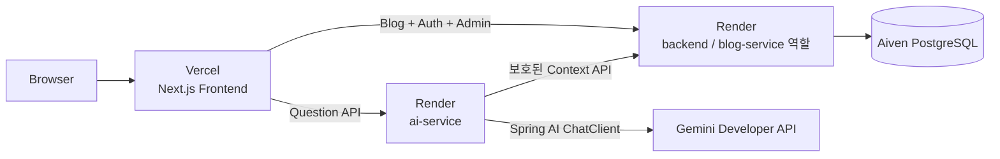
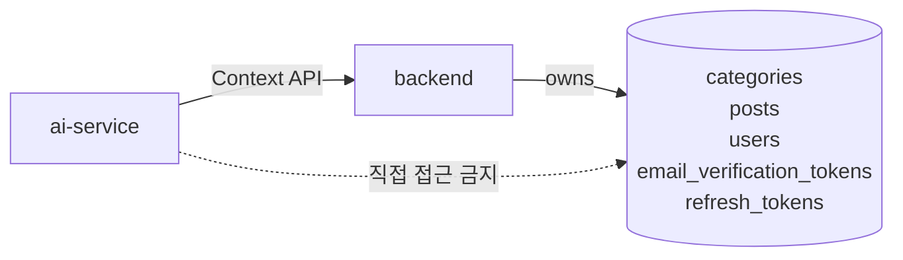

# 3차 아키텍처: Spring AI 서비스 분리

## 시작 조건

2차 단일 Backend에서 Blog·Auth·Admin·Spring AI 전체 흐름이 먼저 동작해야 합니다. 다음 중 하나 이상의 근거가 있을 때만 AI를 분리합니다.

- 모델 호출의 timeout·장애가 Blog API 안정성에 영향을 줍니다.
- AI 기능만 독립적으로 배포하거나 확장할 필요가 있습니다.
- AI 의존성과 메모리 사용을 Blog Backend에서 격리할 필요가 있습니다.
- 요청량과 운영 로그가 별도 서비스 운영 비용을 정당화합니다.

근거가 없으면 2차 단일 Backend 구조를 유지합니다.

## 목표

기존 `backend`가 Blog·Auth·User·Token과 PostgreSQL을 계속 소유하고, 검증된 글 질문 기능만 `ai-service`로 이동합니다.

## 시스템 구조



## 서비스 책임

| 책임                                                | `backend`    | `ai-service`   |
| --------------------------------------------------- | ------------ | -------------- |
| Category·Post·User·Email Verification·Refresh Token | 소유         | 소유하지 않음  |
| PostgreSQL 접근                                     | 가능         | 금지           |
| 공개 Blog·Auth·Admin API                            | 제공         | 제공하지 않음  |
| 글 질문 API                                         | Context 제공 | 외부 요청 처리 |
| 모델 호출                                           | 하지 않음    | 수행           |
| JWT 검증                                            | 발급·검증    | 공개 키로 검증 |

## 목표 프로젝트 디렉터리

```text
tech_blog/
├─ frontend/
│  └─ src/services/
│     ├─ blog.ts                         # backend 호출
│     ├─ auth.ts                         # backend 호출
│     ├─ admin-post.ts                   # backend 호출
│     └─ question.ts                     # ai-service 호출
├─ backend/                              # Blog·Auth 데이터 소유 서비스
│  └─ src/main/java/com/pigpgw/techblog/
│     ├─ category/
│     ├─ post/
│     ├─ auth/
│     ├─ user/
│     ├─ token/
│     └─ internal/                       # ai-service용 보호된 Context API
├─ ai-service/
│  ├─ build.gradle
│  ├─ gradlew
│  ├─ Dockerfile
│  └─ src/
│     ├─ main/java/com/pigpgw/techblogai/
│     │  ├─ TechBlogAiApplication.java
│     │  ├─ question/
│     │  │  ├─ controller/
│     │  │  ├─ service/
│     │  │  └─ dto/
│     │  ├─ client/                      # Backend Context API client
│     │  └─ common/
│     │     ├─ config/
│     │     └─ exception/
│     └─ test/
├─ compose.yaml                          # backend + ai-service + PostgreSQL
└─ docs/
```

`ai-service` package명은 실제 프로젝트 생성 시 확정하며, 위 경로는 목표 구조입니다. 기존 `backend`를 섣불리 rename하지 않아 Render Root Directory와 배포 이력을 유지합니다.

## ERD와 데이터 소유권

3차에서도 ERD는 2차와 동일합니다. AI 질문을 저장하지 않으므로 새 테이블을 만들지 않습니다.



## API 흐름

```text
Browser
→ POST ai-service /api/posts/{slug}/questions
→ ai-service가 access token 검증
→ backend 보호 Context API에서 title·description·content 조회
→ Gemini Developer API 호출
→ 답변 반환
```

내부 Context API는 외부 공개 API와 분리하고 서비스 credential, timeout과 요청 ID를 검증합니다. `ai-service`는 사용자·Post Entity 또는 PostgreSQL credential을 갖지 않습니다.

## 완료 기준

- 분리 전과 같은 질문 API 계약을 유지합니다.
- 두 서비스가 JWT issuer·audience·만료·서명을 동일한 기준으로 검증합니다.
- Backend Context API timeout과 장애 시 AI가 명확한 `503`을 반환합니다.
- AI 장애 중에도 공개 Blog·로그인·관리자 기능이 정상 동작합니다.
- 두 Render 서비스의 배포·rollback·로그·Secret과 자원 사용을 각각 확인합니다.

## 현재 제외

- `identity-service`, Gateway, Eureka, Kafka와 Kubernetes
- AI 전용 Database, Vector DB와 범용 RAG
- 근거 없는 GitHub service 또는 worker 분리
