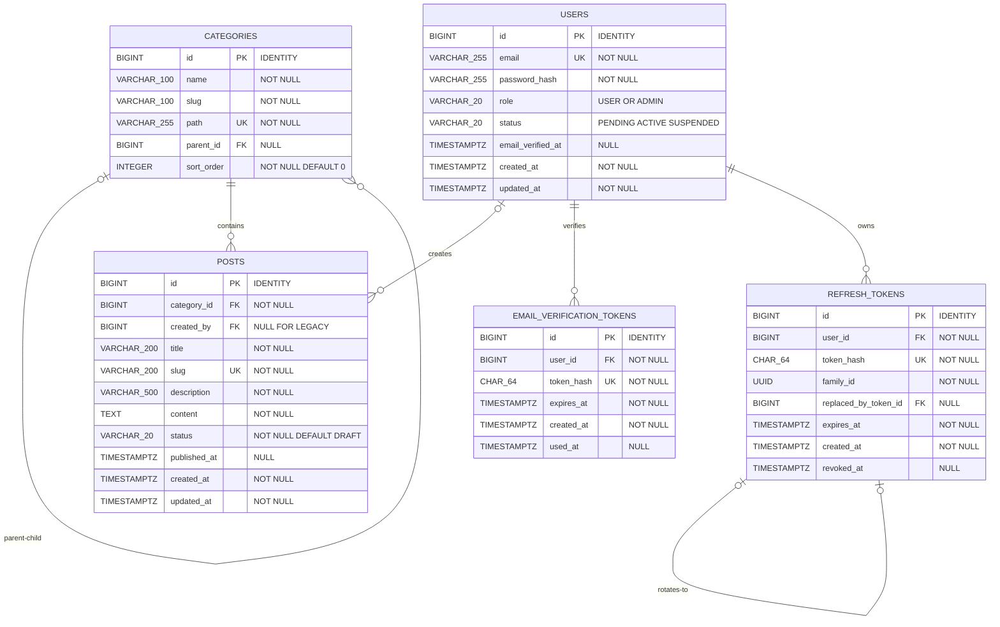
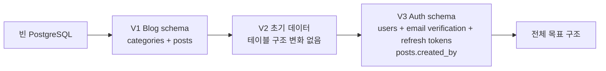

# 기술 블로그 데이터베이스 설계

이 문서는 기존 Frontend의 카테고리 경로와 게시글 응답 형태를 유지하면서 이메일 인증 사용자와 관리자 전용 게시글 관리를 추가하기 위한 PostgreSQL 설계입니다. 전체 목표는 `categories`, `posts`, `users`, `email_verification_tokens`, `refresh_tokens` 다섯 테이블이며 실제 migration은 Blog와 Auth 단계로 나눕니다.

## 단계별 적용

| 개발 단계         | Database 상태                                                   | 상세 문서                                                           |
| ----------------- | --------------------------------------------------------------- | ------------------------------------------------------------------- |
| 1차 Blog          | V1에서 `categories`, `posts` 생성 후 V2에서 기존 글 추가        | [1차 Blog 아키텍처](architecture/phase-1-blog.md)                   |
| 2차 Auth·Admin·AI | V3에서 User·이메일 인증·Refresh Token과 `posts.created_by` 추가 | [2차 Auth·Admin·AI 아키텍처](architecture/phase-2-auth-admin-ai.md) |
| 3차 AI 분리       | 2차 ERD 유지, `ai-service`의 DB 직접 접근 금지                  | [3차 AI Service 아키텍처](architecture/phase-3-ai-service.md)       |

Spring AI 질문과 답변은 현재 저장하지 않으므로 2차와 3차 모두 AI 전용 테이블을 만들지 않습니다.

## 문서 읽는 법

- **전체 목표 ERD**는 2차의 Blog, 로그인과 관리자 게시글 관리가 모두 구현된 뒤의 테이블 구조이며 3차에서도 그대로 유지됩니다.
- **Migration 단계별 변화**는 빈 DB가 V1, V2, V3를 거치며 어떻게 바뀌는지 설명합니다.
- **dbdiagram.io DBML**은 최종 구조를 시각화하는 코드입니다. 이를 그대로 V1 SQL로 내보내지 않습니다.
- V1 Blog schema는 구현해 로컬 PostgreSQL 적용을 확인했습니다. V2 초기 데이터와 V3 Auth schema는 설계 상태입니다.

## 전체 목표 ERD



관계는 다음과 같습니다.

- 최상위 Category의 `parent_id`는 `NULL`입니다.
- 하위 Category는 하나의 부모 Category를 가질 수 있고, Category는 여러 하위 Category를 가질 수 있습니다.
- Post는 반드시 하나의 Category에 속하고, Category는 Post를 가지지 않거나 여러 개 가질 수 있습니다.
- 기존에 가져온 Post는 작성자가 없을 수 있지만 관리자 기능으로 새로 만드는 Post는 로그인한 `ADMIN`의 `users.id`를 `created_by`에 기록합니다.
- 회원가입한 User는 `PENDING`으로 시작하며 유효한 Email Verification Token을 한 번 사용하면 `email_verified_at`을 기록하고 `ACTIVE`로 전환합니다.
- User는 여러 Email Verification Token 발급 이력을 가질 수 있지만 token 원문은 저장하지 않고 만료·사용 여부를 검사합니다.
- User는 여러 Refresh Token을 가질 수 있고 회전된 token은 `replaced_by_token_id`로 다음 token을 참조합니다.
- Category, Post와 작성자 관계는 실수로 연쇄 삭제하지 않도록 `ON DELETE RESTRICT`를 사용하고 User 삭제 시 Email Verification Token과 Refresh Token은 `ON DELETE CASCADE`로 제거합니다.
- V2는 이름 `미분류`, slug·path `uncategorized`인 최상위 보호 Category를 추가합니다. 이 Category는 Service에서 변경·삭제를 제한합니다.

## Category 삭제 정책

- Post는 계속 `category_id NOT NULL`을 유지하며 Category 삭제로 Post를 삭제하거나 Category 연결을 `NULL`로 만들지 않습니다.
- 관리자 화면은 삭제할 Category에 직접 연결된 Post 수와 이동 대상 선택 항목을 표시하고 `미분류`를 기본값으로 제공합니다.
- 관리자는 `미분류` 대신 글의 의미에 맞는 다른 Category를 이동 대상으로 선택할 수 있습니다.
- Backend Service는 하나의 트랜잭션에서 이동 대상과 삭제 대상을 검증하고, 연결된 Post의 `category_id`를 일괄 변경한 다음 기존 Category를 삭제합니다.
- 이동 대상은 삭제 대상과 달라야 하며 실제로 존재해야 합니다.
- 하위 Category가 존재하면 자동으로 이동하지 않고 삭제를 거부합니다. 관리자가 하위 Category를 먼저 이동하거나 정리해야 합니다.
- `미분류` Category는 삭제할 수 없습니다.
- `ON DELETE RESTRICT`는 Service 검증 누락이나 동시 요청에서도 Post·하위 Category의 연쇄 삭제를 막는 최종 안전장치로 유지합니다.

## Migration 단계별 변화

| 버전 | 종류   | 변경 내용                                                       | 완료 기준                                            |
| ---- | ------ | --------------------------------------------------------------- | ---------------------------------------------------- |
| V1   | Schema | `categories`, `posts` 생성                                      | 빈 PostgreSQL에 적용하고 PK·FK·제약조건을 검증       |
| V2   | Data   | 보호된 `미분류`와 기존 공개 Markdown Category·Post 추가         | seed 적용 후 공개 글과 경로가 원본과 일치하는지 검증 |
| V3   | Schema | User·Email Verification·Refresh Token과 `posts.created_by` 추가 | 인증·이메일 token 제약조건과 작성자 FK 검증          |

V1은 로컬 PostgreSQL의 `flyway_schema_history`에서 적용 성공을 확인했고 `categories`, `posts`, PK·FK·UNIQUE·CHECK와 FK index가 생성된 것을 확인했습니다. 제약조건별 실패 동작과 빈 환경의 V1·V2 연속 적용은 후속 단계에서 검증합니다.



V2는 데이터만 추가하므로 ERD 모양이 바뀌지 않습니다. `미분류`는 별도 테이블이나 컬럼이 아니라 `categories`의 보호된 초기 행입니다. V1 구현 시에는 Blog 두 테이블만 만들고, V3가 적용된 뒤에 위의 전체 목표 ERD가 완성됩니다.

## 전체 목표 dbdiagram.io DBML

아래 코드를 dbdiagram.io에 붙여 넣어 최종 ERD를 확인합니다. `increment`는 ERD의 자동 증가 표현이며 실제 Flyway DDL에서는 `GENERATED BY DEFAULT AS IDENTITY`를 사용합니다. 이 코드는 시각화용 최종본이므로 V1 migration SQL로 직접 사용하지 않습니다.

```dbml
Project tech_blog {
  database_type: 'PostgreSQL'
  Note: '전체 목표 schema: Blog + Auth + 관리자 게시글 관리'
}

Table categories {
  id bigint [pk, increment, note: 'Flyway에서는 GENERATED BY DEFAULT AS IDENTITY 사용']
  name varchar(100) [not null]
  slug varchar(100) [not null]
  path varchar(255) [not null, unique]
  parent_id bigint [null]
  sort_order integer [not null, default: 0]

  indexes {
    parent_id [name: 'idx_categories_parent_id']
  }

  checks {
    `slug ~ '^[a-z0-9]+(-[a-z0-9]+)*$'` [name: 'chk_categories_slug_format']
    `path ~ '^[a-z0-9]+(-[a-z0-9]+)*(/[a-z0-9]+(-[a-z0-9]+)*)*$'` [name: 'chk_categories_path_format']
    `parent_id IS NULL OR parent_id <> id` [name: 'chk_categories_not_self_parent']
    `sort_order >= 0` [name: 'chk_categories_sort_order']
  }
}

Table posts {
  id bigint [pk, increment, note: 'Flyway에서는 GENERATED BY DEFAULT AS IDENTITY 사용']
  category_id bigint [not null]
  created_by bigint [null, note: '기존 이관 글은 NULL, 관리자 생성 글은 ADMIN user id']
  title varchar(200) [not null]
  slug varchar(200) [not null, unique]
  description varchar(500) [not null]
  content text [not null]
  status varchar(20) [not null, default: 'DRAFT']
  published_at timestamptz [null]
  created_at timestamptz [not null, default: `CURRENT_TIMESTAMP`]
  updated_at timestamptz [not null, default: `CURRENT_TIMESTAMP`]

  indexes {
    category_id [name: 'idx_posts_category_id']
    created_by [name: 'idx_posts_created_by']
  }

  checks {
    `slug ~ '^[a-z0-9]+(-[a-z0-9]+)*$'` [name: 'chk_posts_slug_format']
    `status IN ('DRAFT', 'PUBLISHED')` [name: 'chk_posts_status']
    `status <> 'PUBLISHED' OR published_at IS NOT NULL` [name: 'chk_posts_published_at']
  }
}

Table users {
  id bigint [pk, increment, note: 'Flyway에서는 GENERATED BY DEFAULT AS IDENTITY 사용']
  email varchar(255) [not null, unique, note: '소문자로 정규화해 저장']
  password_hash varchar(255) [not null, note: '비밀번호 원문 저장 금지']
  role varchar(20) [not null, default: 'USER']
  status varchar(20) [not null, default: 'PENDING']
  email_verified_at timestamptz [null]
  created_at timestamptz [not null, default: `CURRENT_TIMESTAMP`]
  updated_at timestamptz [not null, default: `CURRENT_TIMESTAMP`]

  checks {
    `email = lower(email)` [name: 'chk_users_email_lowercase']
    `role IN ('USER', 'ADMIN')` [name: 'chk_users_role']
    `status IN ('PENDING', 'ACTIVE', 'SUSPENDED')` [name: 'chk_users_status']
    `status <> 'ACTIVE' OR email_verified_at IS NOT NULL` [name: 'chk_users_active_email_verified']
  }
}

Table email_verification_tokens {
  id bigint [pk, increment, note: 'Flyway에서는 GENERATED BY DEFAULT AS IDENTITY 사용']
  user_id bigint [not null]
  token_hash char(64) [not null, unique, note: '일회용 token의 SHA-256 hash']
  expires_at timestamptz [not null]
  created_at timestamptz [not null, default: `CURRENT_TIMESTAMP`]
  used_at timestamptz [null]

  indexes {
    user_id [name: 'idx_email_verification_tokens_user_id']
    expires_at [name: 'idx_email_verification_tokens_expires_at']
  }

  checks {
    `expires_at > created_at` [name: 'chk_email_verification_tokens_expiration']
    `used_at IS NULL OR used_at >= created_at` [name: 'chk_email_verification_tokens_used_at']
  }
}

Table refresh_tokens {
  id bigint [pk, increment, note: 'Flyway에서는 GENERATED BY DEFAULT AS IDENTITY 사용']
  user_id bigint [not null]
  token_hash char(64) [not null, unique, note: '고엔트로피 token의 SHA-256 hash']
  family_id uuid [not null, note: '회전 계열과 재사용 탐지']
  replaced_by_token_id bigint [null, unique]
  expires_at timestamptz [not null]
  created_at timestamptz [not null, default: `CURRENT_TIMESTAMP`]
  revoked_at timestamptz [null]

  indexes {
    user_id [name: 'idx_refresh_tokens_user_id']
    family_id [name: 'idx_refresh_tokens_family_id']
    expires_at [name: 'idx_refresh_tokens_expires_at']
  }

  checks {
    `expires_at > created_at` [name: 'chk_refresh_tokens_expiration']
    `revoked_at IS NULL OR revoked_at >= created_at` [name: 'chk_refresh_tokens_revoked_at']
    `replaced_by_token_id IS NULL OR replaced_by_token_id <> id` [name: 'chk_refresh_tokens_not_self_replaced']
  }
}

Ref fk_categories_parent: categories.parent_id >? categories.id [delete: restrict, update: no action]
Ref fk_posts_category: posts.category_id > categories.id [delete: restrict, update: no action]
Ref fk_posts_creator: posts.created_by >? users.id [delete: restrict, update: no action]
Ref fk_email_verification_tokens_user: email_verification_tokens.user_id > users.id [delete: cascade, update: no action]
Ref fk_refresh_tokens_user: refresh_tokens.user_id > users.id [delete: cascade, update: no action]
Ref fk_refresh_tokens_replaced_by: refresh_tokens.replaced_by_token_id >? refresh_tokens.id [delete: set null, update: no action]
```

## `categories`

| 컬럼         | PostgreSQL 타입                           | Null | 기본값   | 제약과 역할                                                  |
| ------------ | ----------------------------------------- | ---- | -------- | ------------------------------------------------------------ |
| `id`         | `BIGINT GENERATED BY DEFAULT AS IDENTITY` | 불가 | Identity | 내부 PK이며 API에 직접 노출하지 않습니다.                    |
| `name`       | `VARCHAR(100)`                            | 불가 | 없음     | 화면에 표시할 이름입니다.                                    |
| `slug`       | `VARCHAR(100)`                            | 불가 | 없음     | 현재 경로 구간입니다. 소문자 영문·숫자·하이픈만 허용합니다.  |
| `path`       | `VARCHAR(255)`                            | 불가 | 없음     | `ai/prompt-engineering` 형태의 전체 경로이며 `UNIQUE`입니다. |
| `parent_id`  | `BIGINT`                                  | 가능 | `NULL`   | `categories.id`를 참조하는 자기참조 FK입니다.                |
| `sort_order` | `INTEGER`                                 | 불가 | `0`      | 같은 부모 아래 표시 순서이며 0 이상만 허용합니다.            |

추가 규칙:

- `path`의 각 구간은 `slug`와 같은 형식만 허용합니다.
- `parent_id`가 자신의 `id`와 같을 수 없도록 `CHECK`를 둡니다.
- 여러 단계의 순환 참조와 `parent.path + '/' + slug` 일치는 Service와 통합 테스트에서 검증합니다. 현재 MVP에는 DB trigger를 추가하지 않습니다.

## `posts`

| 컬럼           | PostgreSQL 타입                           | Null | 기본값              | 제약과 역할                                                        |
| -------------- | ----------------------------------------- | ---- | ------------------- | ------------------------------------------------------------------ |
| `id`           | `BIGINT GENERATED BY DEFAULT AS IDENTITY` | 불가 | Identity            | 내부 PK입니다. API에서는 문자열로 변환합니다.                      |
| `category_id`  | `BIGINT`                                  | 불가 | 없음                | `categories.id`를 참조하는 FK입니다.                               |
| `created_by`   | `BIGINT`                                  | 가능 | `NULL`              | `users.id`를 참조합니다. 기존 이관 글은 작성자가 없을 수 있습니다. |
| `title`        | `VARCHAR(200)`                            | 불가 | 없음                | 게시글 제목입니다.                                                 |
| `slug`         | `VARCHAR(200)`                            | 불가 | 없음                | 공개 상세 URL 식별자이며 `UNIQUE`입니다.                           |
| `description`  | `VARCHAR(500)`                            | 불가 | 없음                | 목록과 메타데이터에 사용하는 요약입니다.                           |
| `content`      | `TEXT`                                    | 불가 | 없음                | 길이가 정해지지 않은 Markdown 본문입니다.                          |
| `status`       | `VARCHAR(20)`                             | 불가 | `DRAFT`             | `DRAFT`, `PUBLISHED`만 허용합니다.                                 |
| `published_at` | `TIMESTAMPTZ`                             | 가능 | `NULL`              | 최초 공개 시점입니다. `PUBLISHED`이면 반드시 값이 있어야 합니다.   |
| `created_at`   | `TIMESTAMPTZ`                             | 불가 | `CURRENT_TIMESTAMP` | 생성 시점입니다.                                                   |
| `updated_at`   | `TIMESTAMPTZ`                             | 불가 | `CURRENT_TIMESTAMP` | 수정 시점이며 갱신 책임은 Service에 둡니다.                        |

관리자 게시글 생성 Service는 인증된 사용자의 role이 `ADMIN`인지 확인하고 `created_by`를 반드시 기록합니다. 일반 회원가입 요청으로 role을 지정하거나 변경할 수 없습니다.

## `users`

| 컬럼                | PostgreSQL 타입                           | Null | 기본값              | 제약과 역할                                                 |
| ------------------- | ----------------------------------------- | ---- | ------------------- | ----------------------------------------------------------- |
| `id`                | `BIGINT GENERATED BY DEFAULT AS IDENTITY` | 불가 | Identity            | 내부 PK입니다.                                              |
| `email`             | `VARCHAR(255)`                            | 불가 | 없음                | 로그인 ID이며 소문자로 정규화하고 `UNIQUE`로 보호합니다.    |
| `password_hash`     | `VARCHAR(255)`                            | 불가 | 없음                | `PasswordEncoder` 결과만 저장하고 원문은 저장하지 않습니다. |
| `role`              | `VARCHAR(20)`                             | 불가 | `USER`              | `USER`, `ADMIN`만 허용합니다. 회원가입은 항상 `USER`입니다. |
| `status`            | `VARCHAR(20)`                             | 불가 | `PENDING`           | `PENDING`, `ACTIVE`, `SUSPENDED`만 허용합니다.              |
| `email_verified_at` | `TIMESTAMPTZ`                             | 가능 | `NULL`              | 이메일 인증 완료 시점이며 `ACTIVE`이면 값이 필요합니다.     |
| `created_at`        | `TIMESTAMPTZ`                             | 불가 | `CURRENT_TIMESTAMP` | 생성 시점입니다.                                            |
| `updated_at`        | `TIMESTAMPTZ`                             | 불가 | `CURRENT_TIMESTAMP` | 수정 시점입니다.                                            |

일반 회원가입은 `PENDING`으로 생성하고 이메일 인증 완료 후 `ACTIVE`로 전환합니다. 관리자 계정은 공개 API나 migration의 평문 비밀번호로 만들지 않습니다. 서버 측 일회성 bootstrap 절차로 생성하고 실제 비밀번호와 hash를 저장소에 남기지 않습니다.

## `email_verification_tokens`

| 컬럼         | PostgreSQL 타입                           | Null | 기본값              | 제약과 역할                                     |
| ------------ | ----------------------------------------- | ---- | ------------------- | ----------------------------------------------- |
| `id`         | `BIGINT GENERATED BY DEFAULT AS IDENTITY` | 불가 | Identity            | 내부 PK입니다.                                  |
| `user_id`    | `BIGINT`                                  | 불가 | 없음                | 인증 대상 `users.id`를 참조합니다.              |
| `token_hash` | `CHAR(64)`                                | 불가 | 없음                | 일회용 token의 SHA-256 hash이며 `UNIQUE`입니다. |
| `expires_at` | `TIMESTAMPTZ`                             | 불가 | 없음                | 인증 가능 만료 시점입니다.                      |
| `created_at` | `TIMESTAMPTZ`                             | 불가 | `CURRENT_TIMESTAMP` | 발급 시점입니다.                                |
| `used_at`    | `TIMESTAMPTZ`                             | 가능 | `NULL`              | 인증에 사용된 시점입니다.                       |

Email Verification Token 원문은 이메일 link에만 전달하고 DB·응답·로그에 남기지 않습니다. 재발송 시 Service는 만료되지 않고 사용되지 않은 최신 token만 인정합니다.

## `refresh_tokens`

| 컬럼                   | PostgreSQL 타입                           | Null | 기본값              | 제약과 역할                                                          |
| ---------------------- | ----------------------------------------- | ---- | ------------------- | -------------------------------------------------------------------- |
| `id`                   | `BIGINT GENERATED BY DEFAULT AS IDENTITY` | 불가 | Identity            | 내부 PK입니다.                                                       |
| `user_id`              | `BIGINT`                                  | 불가 | 없음                | `users.id`를 참조합니다.                                             |
| `token_hash`           | `CHAR(64)`                                | 불가 | 없음                | 고엔트로피 token의 SHA-256 hash이며 `UNIQUE`입니다.                  |
| `family_id`            | `UUID`                                    | 불가 | 없음                | 같은 회전 계열을 묶어 탈취 token 재사용 시 계열 전체를 폐기합니다.   |
| `replaced_by_token_id` | `BIGINT`                                  | 가능 | `NULL`              | 회전 후 발급한 `refresh_tokens.id`를 참조하며 `UNIQUE`로 보호합니다. |
| `expires_at`           | `TIMESTAMPTZ`                             | 불가 | 없음                | 만료 시점입니다.                                                     |
| `created_at`           | `TIMESTAMPTZ`                             | 불가 | `CURRENT_TIMESTAMP` | 발급 시점입니다.                                                     |
| `revoked_at`           | `TIMESTAMPTZ`                             | 가능 | `NULL`              | 회전, logout 또는 재사용 탐지로 폐기한 시점입니다.                   |

## 제약조건과 인덱스

Blog migration에서 다음 항목을 구현합니다.

- `categories.path`, `posts.slug`에 `UNIQUE` 제약조건을 둡니다. PostgreSQL이 생성하는 Unique B-tree index를 중복 생성하지 않습니다.
- `categories.parent_id`, `posts.category_id`에는 FK 탐색을 위한 일반 index를 각각 둡니다.
- `sort_order >= 0`, Category/Post slug 형식, Category path 형식과 Post status를 `CHECK`로 제한합니다.
- `status = 'PUBLISHED'`이면 `published_at IS NOT NULL`이 되도록 `CHECK`를 둡니다.
- 공개 목록용 복합 또는 부분 index는 실제 조회 SQL과 `EXPLAIN (ANALYZE, BUFFERS)`를 확인한 뒤 추가합니다.

Auth migration에서는 다음 항목을 구현합니다.

- `users.email`, `email_verification_tokens.token_hash`, `refresh_tokens.token_hash`에 `UNIQUE` 제약조건을 둡니다.
- `users.role`, `users.status`, email 소문자, Email Verification·Refresh Token 만료 관계를 `CHECK`로 제한합니다.
- `ACTIVE` User는 `email_verified_at` 값이 필요하도록 `CHECK`로 보호합니다.
- `posts.created_by`, Email Verification·Refresh Token의 `user_id`와 만료 시점, Refresh Token의 `family_id`에 조회 목적 index를 둡니다.
- token 원문은 DB에 저장하지 않고 hash만 조회·폐기합니다.

## 타입 선택 이유

- `IDENTITY`: sequence를 직접 관리하는 대신 PostgreSQL 표준 Identity로 내부 PK를 생성합니다. PK 제약조건을 별도로 선언해 유일성과 `NOT NULL`을 보장합니다.
- `TEXT`: Markdown 본문은 길이가 일정하지 않으므로 임의의 최대 길이를 두지 않습니다.
- `TIMESTAMPTZ`: 로컬, Render와 Aiven의 시간대가 달라도 같은 시점을 저장하도록 합니다. API의 `publishedAt`은 기존 화면을 유지하기 위해 `Asia/Seoul` 기준 `YYYY-MM-DD` 문자열로 변환합니다.
- `VARCHAR` status: 현재 두 상태만 `CHECK`로 제한하고, PostgreSQL enum 변경 migration의 부담 없이 이후 상태를 확장할 수 있게 합니다.
- `path`: 계층에서 계산할 수 있는 값이지만 기존 Frontend의 `categoryId`와 공개 URL을 안정적으로 유지하고 조회 시 재귀 조합을 피하기 위해 저장합니다.
- `CHAR(64)` token hash: 고엔트로피 Email Verification·Refresh Token을 SHA-256으로 변환한 64자리 16진수만 저장합니다.
- `UUID` family: refresh token 회전 계열을 식별해 폐기된 token 재사용 시 같은 계열을 함께 무효화합니다.

## API 매핑

| API 필드            | DB 값                   | 변환 규칙                                                    |
| ------------------- | ----------------------- | ------------------------------------------------------------ |
| Category `id`       | `categories.path`       | 숫자 PK 대신 전체 경로를 반환합니다.                         |
| Category `parentId` | 부모 `categories.path`  | 최상위 Category는 `null`입니다.                              |
| Category `order`    | `categories.sort_order` | 이름만 변환합니다.                                           |
| Post `id`           | `posts.id`              | 문자열로 변환합니다.                                         |
| Post `categoryId`   | `categories.path`       | Category를 JOIN해 반환합니다.                                |
| Post `draft`        | `posts.status`          | 공개 API는 `PUBLISHED`만 조회하고 항상 `false`를 반환합니다. |
| Post `publishedAt`  | `posts.published_at`    | `Asia/Seoul` 기준 `YYYY-MM-DD`로 변환합니다.                 |

## Migration 파일 계획

파일 작성·적용·이력 확인 절차는 [Flyway migration 가이드](setup/flyway.md)를 따릅니다.

### V1 Blog schema

- 파일: `backend/src/main/resources/db/migration/V1__create_blog_schema.sql`
- 범위: `categories`, `posts`, Blog 제약조건과 FK index
- 제외: `users`, `email_verification_tokens`, `refresh_tokens`, `posts.created_by`와 credential

### V2 초기 데이터

- 파일: `backend/src/main/resources/db/migration/V2__seed_initial_post.sql`
- 범위: 보호된 최상위 `미분류` Category와 기존 공개 Markdown Category·Post 데이터
- 구조 변경: 없음

### V3 Auth schema

- 파일: `backend/src/main/resources/db/migration/V3__create_auth_schema.sql`
- 범위: `users`, `email_verification_tokens`, `refresh_tokens`, nullable `posts.created_by`, Auth 제약조건과 index
- 일반 회원: `PENDING`으로 생성하고 이메일 인증 완료 후 `email_verified_at` 기록과 함께 `ACTIVE`로 전환
- 기존 글: `created_by=NULL`을 허용
- 새 관리자 글: Service에서 인증된 ADMIN의 User id를 `created_by`에 필수 기록
- 관리자 계정: migration에 credential을 넣지 않고 서버 측 일회성 bootstrap 절차로 생성

## Migration 공통 원칙

- 적용된 migration은 수정하지 않고 다음 버전 migration으로 변경합니다.
- 한 파일에는 이름으로 설명할 수 있는 하나의 schema 또는 data 변경 목적만 둡니다.
- 로컬, 테스트와 운영 DB에 같은 migration 파일을 같은 순서로 적용합니다.
- 실제 DDL, migration 실행과 제약조건 검증이 끝나기 전에는 관련 TODO를 완료 처리하지 않습니다.

## 참고

- [PostgreSQL Identity Columns](https://www.postgresql.org/docs/current/ddl-identity-columns.html)
- [PostgreSQL Constraints](https://www.postgresql.org/docs/current/ddl-constraints.html)
- [PostgreSQL Date/Time Types](https://www.postgresql.org/docs/current/datatype-datetime.html)
